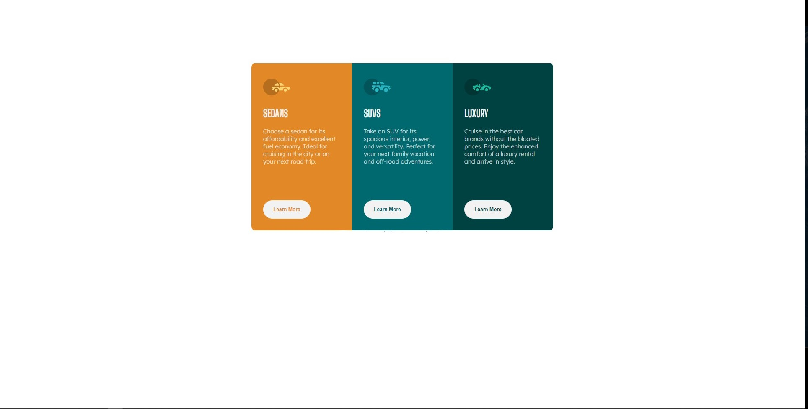
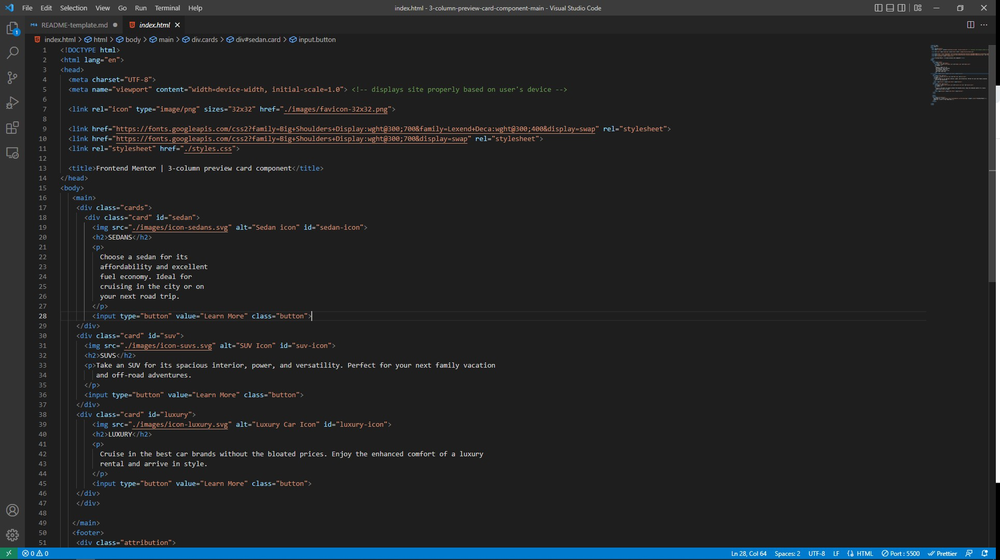
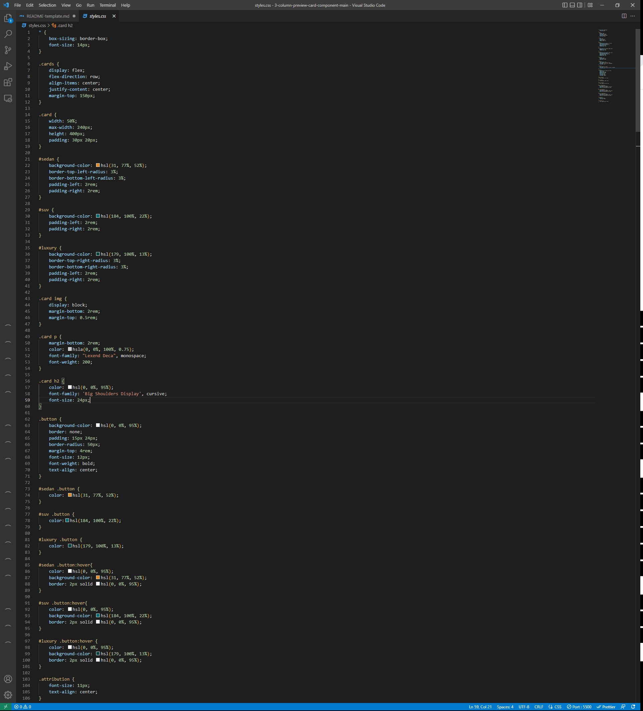

# Frontend Mentor - 3-column preview card component solution

This is a solution to the [3-column preview card component challenge on Frontend Mentor](https://www.frontendmentor.io/challenges/3column-preview-card-component-pH92eAR2-). Frontend Mentor challenges help you improve your coding skills by building realistic projects.

## Table of contents

- [Overview](#overview)
  - [The challenge](#the-challenge)
  - [Screenshot](#screenshot)
  - [Links](#links)
- [My process](#my-process)
  - [Built with](#built-with)
  - [What I learned](#what-i-learned)
  - [Continued development](#continued-development)
- [Author](#author)

## Overview

### The challenge

Users should be able to:

- View the optimal layout depending on their device's screen size
- See hover states for interactive elements

### Screenshot





### Links

- Solution URL: [Add solution URL here](https://your-solution-url.com)
- Live Site URL: [Add live site URL here](https://your-live-site-url.com)

## My process

### Built with

- Semantic HTML5 markup
- CSS custom properties
- Flexbox

### What I learned

I finally started to understand the css box model to an extent and also how to use flexbox to an extent.

To see how you can add code snippets, see below:

```css
.cards {
  display: flex;
  flex-direction: row;
  align-items: center;
  justify-content: center;
  margin-top: 150px;
}
```

### Continued development

I definitely continue to work on understanding the box model and how to create beeter and more responsive layout

## Author

- Website - [SamuelOsewa](https://github.com/SamuelOsewa)
- Frontend Mentor - [@SamuelOsewa](https://www.frontendmentor.io/profile/SamuelOsewa)
- Twitter - [@unpaidlandlord7](https://www.twitter.com/unpaidlandlord7)
